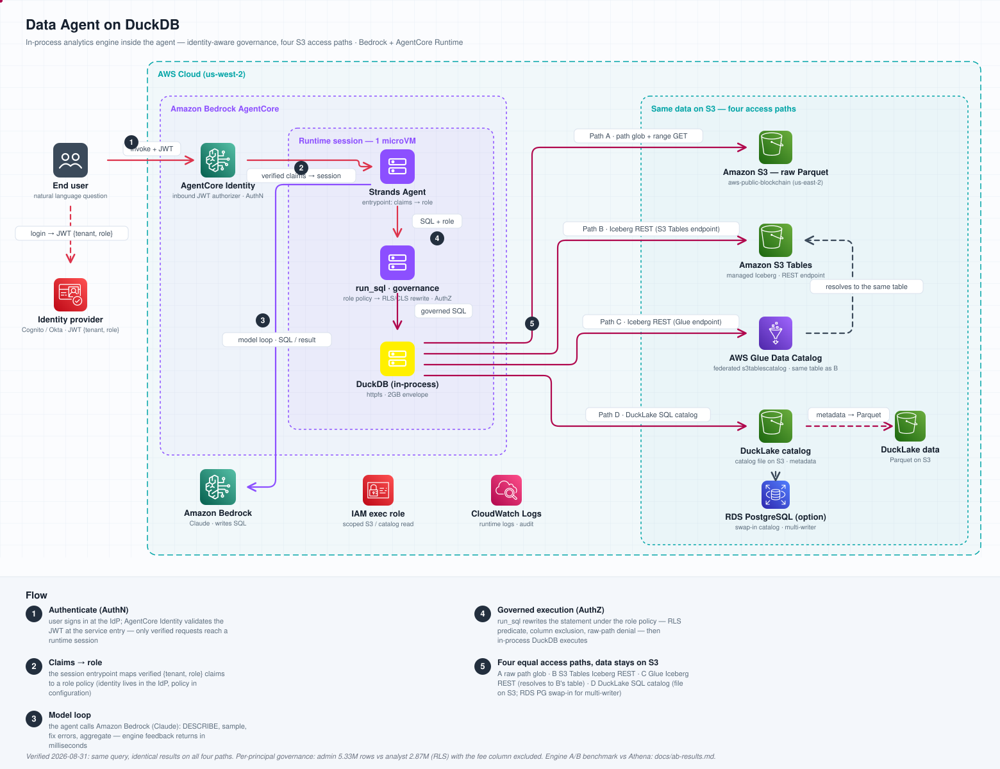

# Data Agent on DuckDB

A Bedrock (Claude) agent with an **in-process DuckDB** engine that queries
data directly on Amazon S3 — no cluster, no warehouse, no ETL. The solution
implements four S3 table-access methods behind one engine and an
identity-aware row/column-level governance layer in front of it.

> [!WARNING]
> This is a reference implementation, provided as is. Before production use,
> add monitoring/alerting, rate limiting, HA, fine-grained audit trails, and
> hardened credential rotation for your environment.



<details>
<summary>Architecture (text version)</summary>

```
User ──▶ AgentCore Runtime (1 session = 1 microVM = 1 DuckDB)
          ├─ AuthN: inbound JWT authorizer → claims {tenant, role}
          ├─ AuthZ: governance.py — principal→role→policy,
          │         sqlglot RLS/CLS rewrite BEFORE the engine
          ├─ Strands Agent + Bedrock Claude (writes SQL, reads results)
          └─ DuckDB in-process (httpfs/iceberg/ducklake extensions)
               ├─ Path A: raw Parquet   — S3 path glob (public dataset)
               ├─ Path B: S3 Tables     — native Iceberg REST catalog
               ├─ Path C: Glue catalog  — same table, federated endpoint
               └─ Path D: DuckLake      — SQL-database catalog, Parquet on S3
Aux: IAM execution role (least privilege) · CloudWatch Logs
```
</details>

## Why in-process

AWS announced the [acquisition of DuckLabs](https://aws.amazon.com/blogs/big-data/aws-and-ducklabs-building-the-future-of-analytics-together/)
(2026-08-26) noting that DuckDB targets *"the 90%+ of data queries in the
world today, that often runs 1 terabyte of data or less"* and that *"DuckDB
ends up being naturally optimized for AI agents to use"*; the same post
reports 2.5B+ queries processed by the Amazon Quick engine with its DuckDB
integrations. This sample is a deployable
implementation of the same architectural idea — externalize state to S3,
governance to a SQL-rewrite layer, scheduling to the agent platform, and keep
compute in-process:

| Mechanism | Why a remote query service can't give you this |
|---|---|
| **Millisecond feedback loop** | Agents iterate (DESCRIBE → sample → fix error → aggregate), 5-10 SQL per question. In-process failures cost ms and zero tokens; per-query service overhead is paid on every retry. |
| **Session state** | Intermediate results are in-process temp tables; "grab a subset, then reason over it" costs nothing. Remote calls are stateless. |
| **Blast radius** | Agent-generated SQL never touches shared production infra. Worst case: one session OOMs itself. Credentials: read-only. |
| **No second scheduler** | The agent platform's session scheduling *is* the resource management. No queue, no workload groups, no tenant arbitration. |

**When NOT to use this pattern**: data already lives in a governed warehouse
(connect to it directly), or single queries scan multi-TB working sets
(distributed engines exist for a reason). See [docs/design.md](docs/design.md)
for the decision table.

## S3 access methods

Same engine, same agent code — only how a table name resolves to files
differs. Raw Parquet is always on; the others mount `READ_ONLY` when their
env var is set:

| Path | Access method | Alias | Resolution | Env toggle |
|---|---|---|---|---|
| **A** | Raw Parquet | views / `read_parquet` | S3 path glob + LIST | (always on) |
| **B** | S3 Tables (Iceberg REST) | `s3t.*` | S3 Tables native endpoint | `S3_TABLES_ARN` |
| **C** | Glue Data Catalog (Iceberg REST) | `glue.*` | Glue endpoint, federated `s3tablescatalog` | `GLUE_CATALOG` |
| **D** | DuckLake | `dl.*` | SQL catalog database, Parquet on S3 | `DUCKLAKE_CATALOG` |

Paths B and C resolve the *same physical Iceberg table* through two different
endpoints (engine-direct IAM vs organization-wide catalog). Path D defaults
to a single-file catalog on S3; a PostgreSQL catalog form is supported for
multi-writer estates (see `docs/design.md`).

## Identity-aware governance (row/column-level)

An **engine-neutral SQL rewrite layer** in front of DuckDB — the same
query-rewrite pattern BI platforms use to enforce row-level security ahead
of an embedded engine. Authentication and authorization are two layers with
one narrow contract (verified claims):

- **AuthN** — AgentCore's inbound JWT authorizer validates tokens before
  agent code runs; claims carry `tenant`/`role`. SigV4 fallback paths accept
  the runtime user-id header or a payload identity asserted by the calling
  application.
- **AuthZ** — `governance.py` maps principal → role → policy, then rewrites
  every statement with sqlglot: RLS predicates ANDed in, denied columns
  `EXCLUDE`d, raw-path access rejected. Fail-closed on unparseable input.
- **Policies are configuration** (`GOVERNANCE_POLICIES` env, JSON): per-table
  `row_filter` / `deny_columns` + an `allow_raw_paths` switch, keyed by
  `tenant:role`.
- Applies identically across all four access methods (policy matches the
  logical table name), and every `run_sql` result reports `"governed":
  true|false`.

Why a rewrite layer instead of Lake Formation data filters: LF row/column
filters are enforced *inside* LF-integrated engines (Athena, Redshift, EMR).
For a third-party in-process engine, LF grants stop at table level — so
fine-grained governance for an embedded engine must happen before the SQL
reaches it, which is exactly this layer.

## Prerequisites

- Python 3.11–3.13 (3.14 lacks prebuilt duckdb wheels)
- An AWS account with Amazon Bedrock model access (Claude) in your region
- AWS CDK v2 (`npm i -g aws-cdk`) for infrastructure deployment
- AWS credentials configured (`aws sts get-caller-identity` works)

## Deploy

```bash
# 1. Infrastructure (S3 Tables bucket, DuckLake bucket, execution role, logs)
cd infra && pip install -r requirements.txt && cdk deploy
# note the stack outputs: TableBucketArn, GlueCatalogId, DuckLakeCatalog, ExecutionRoleArn

# 2. Load the sample dataset (DuckDB itself writes the Iceberg table — no Spark/Glue job)
cd .. && python3.13 -m venv .venv && ./.venv/bin/pip install -r requirements.txt
./.venv/bin/python scripts/load_s3tables.py \
    --table-bucket-arn <TableBucketArn> --ducklake <DuckLakeCatalog>

# 3. Agent runtime
./.venv/bin/pip install bedrock-agentcore-starter-toolkit
./.venv/bin/agentcore configure --entrypoint agent.py --name duckdb_analyst \
    --execution-role <ExecutionRoleArn> --region <your-region> --non-interactive
./.venv/bin/agentcore launch

# 4. Ask a question
./.venv/bin/agentcore invoke '{"prompt": "How many BTC transactions on 2026-08-25?"}'
```

Local one-shot mode (no runtime deployment): `./.venv/bin/python agent.py "your question"`.
Copy `.env.example` to set the optional path toggles.

## Use it

Representative scenarios, in increasing depth:

**Schema exploration** — "What columns does the Bitcoin transactions table
have?" The agent DESCRIBEs a single-day partition (not a full scan), then
samples with LIMIT 5. Partition-pruning discipline comes from the system
prompt.

**Working set / session state** — "Build a working set of transfers above
1 BTC on 2026-08-25, then: how many? P50/P90/P99 of amounts? the 10
highest-fee ones?" The agent runs one `CREATE TEMP TABLE` (a single S3 scan),
then all follow-ups hit the in-process table — `engine_ms` drops from seconds
to milliseconds, zero S3 re-scans. A warehouse-based flow needs CTAS +
cleanup; here the temp table dies with the session.

**Access-path comparison** — the same aggregation through paths A–D returns
identical results with per-path `engine_ms`; the engine never changes while
the catalog strategy evolves with governance needs.

**Governance** — run the same question as two principals:

```bash
agentcore invoke '{"prompt": "...", "identity": {"tenant": "ops",   "role": "admin"}}'
agentcore invoke '{"prompt": "...", "identity": {"tenant": "cex-a", "role": "analyst"}}'
```

The restricted tenant sees an RLS-filtered window, denied columns do not
exist for the engine (the model truthfully reports that), and raw-path
access is rejected with an error the model can explain.

**Self-repair** — a wrong column name comes back as an engine error in
milliseconds; the model reads it, DESCRIBEs, and fixes its own SQL.

## Project structure

| Path | What |
|---|---|
| `agent.py` | Strands agent + gated `run_sql` DuckDB tool; AgentCore entrypoint and local CLI |
| `governance.py` | Identity-aware authorization: principal→role→policy + sqlglot RLS/CLS rewrite |
| `data_catalog.py` | Dataset catalog + query-cost discipline injected into the system prompt |
| `infra/` | CDK app: S3 Tables bucket, DuckLake bucket, least-privilege execution role |
| `scripts/load_s3tables.py` | One-command data load — DuckDB writes Iceberg via S3 Tables REST |
| `scripts/ab_compare.py` | Reproduce the in-process vs. query-service comparison table |
| `scripts/cleanup.sh` | Tear everything down (runtime + stack + data) |
| `tests/unit/` | Unit tests (SQL gate, governance rewrite, truncation, path toggles, concurrency) — no network needed |
| `docs/design.md` | Design notes: invariants, governance rationale, decision table |

## Cost

Main cost drivers: Amazon Bedrock model invocations (per token), AgentCore
Runtime session compute (per consumption), S3 requests/storage for the sample
dataset (a few GB), and S3 Tables storage/maintenance. There are no always-on
compute resources; idle cost is storage only. Estimate with the
[AWS Pricing Calculator](https://calculator.aws/) for your region and usage.

## Cleanup

```bash
./scripts/cleanup.sh        # agentcore runtime + data + cdk destroy
```

## Security

See [CONTRIBUTING](CONTRIBUTING.md#security-issue-notifications) for how to
report security issues. Do not create public GitHub issues for security
findings.

## License

MIT-0. See [LICENSE](LICENSE).
